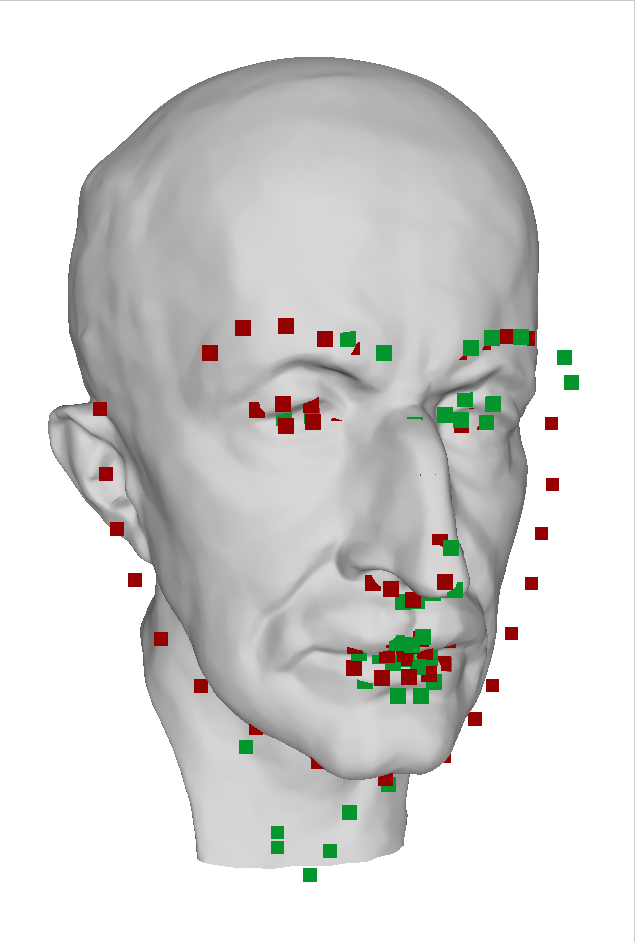
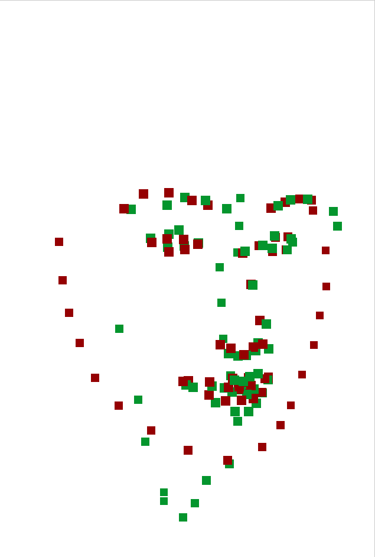

# landmark_triangulation

- Input
  - Associated 2D points (e.g. facial landmarks) on multiple images
  - Camera parameters (extrinsic and intrinsic) of the images
- Output
  - 3D positions corresponding to the 2D points

The main algorithm is included in `triangulation.py`.

## Try it

All resulted files are included. The files generated on your environment may be slightly different.

- Step 0: Render mesh to generate synthesic images and camera parameters

  - Run `python render.py`. The rendered images and camera parameter txts will appear in `./data/`
    - `max-planck.obj`: A head model of famous guy in physics and sometimes in CG. Gottten from [here](https://github.com/alecjacobson/common-3d-test-models/blob/master/data/max-planck.obj).

- Step 1: Detect 2D landmarks

  - Run `python detection.py`. You will get the detected results in `./data/detected`.

- Step 2: Triangulation to make 3D landmarks

  - Run `python triangulation.py`. You will see the results in `./data/triangulation/`. This step executes two algorithms with all detected landmarks including erroneous detections.
    - Least squares with all views: `triangulated_all.obj`
    - View selection with RANSAC: `triangulated_ransac.obj`

## Algorithm

Detected landmarks by deep neural network may not have 3D consistency especially for side faces.
Least squares (green points) is vulnerable to such erroneous inputs. Mouse and chin points are collapsed.
RANSAC (red points) can triagulate face like points by removing outlier views. Unfortunately, chin points are still far from ground truth surface because of inaccuracy of the inputs.

|              Results with ground truth mesh              |                      Results only                      |
| :------------------------------------------------------: | :----------------------------------------------------: |
|  |  |
